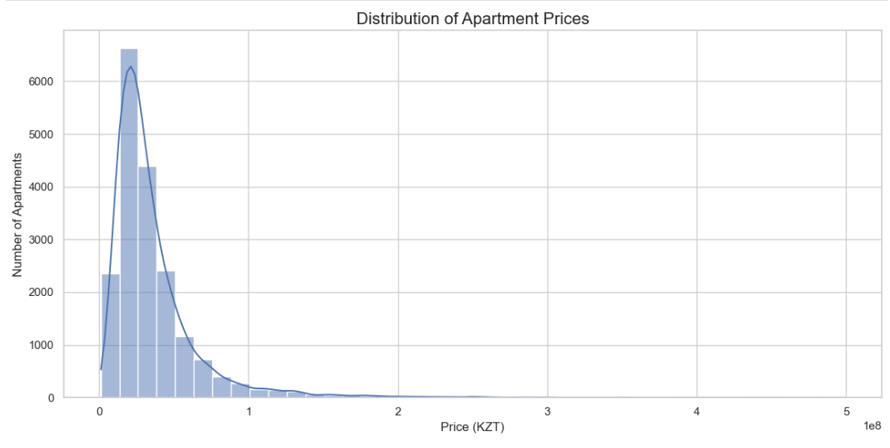
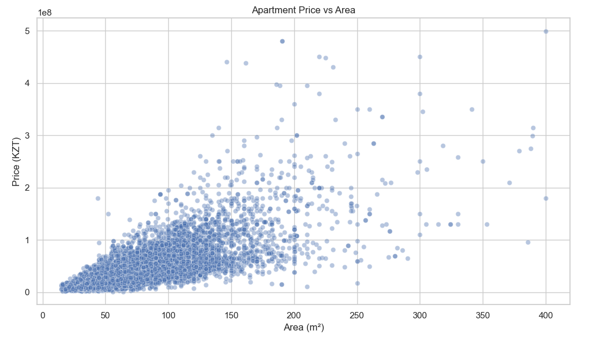
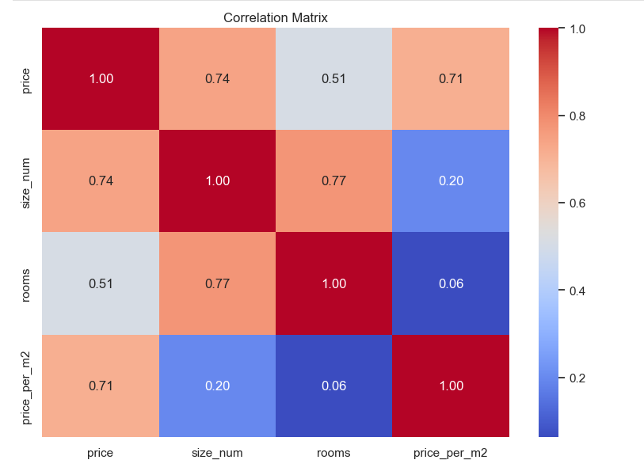

# Krisha.kz Apartment Market Analysis

A data analysis project that collects apartment listings from **Krisha.kz** using web scraping techniques and explores the Kazakhstan real estate market through data cleaning, feature engineering, and visualization.

---

## Project Overview

This project demonstrates a complete data analysis workflow:

- Web scraping apartment listings from Krisha.kz
- Data cleaning and preprocessing
- Feature engineering
- Exploratory Data Analysis (EDA)
- Data visualization
- Statistical summary of the housing market

The final dataset was analyzed to identify relationships between apartment prices, size, number of rooms, seller type, and location.

---

## Technologies Used

- Python
- Requests
- BeautifulSoup
- Pandas
- NumPy
- Matplotlib
- Seaborn
- Regular Expressions (re)

---

## Project Structure

```
KrishaKZ/
│
├── data/
│   ├── krisha_clean.csv
│   └── krisha_final.csv
│
├── figures/
│   ├── price_distribution.png
│   ├── price_boxplot.png
│   ├── rooms_distribution.png
│   ├── average_price_rooms.png
│   ├── price_vs_area.png
│   ├── price_per_m2.png
│   ├── seller_types.png
│   ├── top_locations.png
│   └── correlation_matrix.png
│
├── main.py
├── requirements.txt
├── .gitignore
└── README.md
```

---

## Dataset Features

The dataset contains information about apartment listings, including:

- Property type
- Price
- Apartment size
- Number of rooms
- Floor
- Seller type
- Location
- Price per square meter

---

## Data Processing

The following preprocessing steps were performed:

- Removed missing values
- Converted prices into numeric format
- Extracted apartment size
- Calculated price per square meter
- Removed unrealistic outliers
- Generated a cleaned dataset for analysis

---

## Exploratory Data Analysis

The project includes the following visualizations:

- Apartment price distribution
- Price boxplot
- Apartment distribution by number of rooms
- Average apartment price by room count
- Price vs apartment size
- Average price per square meter
- Seller type distribution
- Top apartment locations
- Correlation heatmap

---

## Example Visualizations

### Price Distribution



### Price vs Apartment Size



### Correlation Matrix



---

## Installation

Clone the repository:

```bash
git clone https://github.com/yourusername/KrishaKZ.git
```

Install the required libraries:

```bash
pip install -r requirements.txt
```

Run the project:

```bash
python main.py
```

---

## Future Improvements

Possible improvements include:

- Scraping additional apartment information
- Interactive dashboard using Plotly or Power BI
- Machine Learning model for apartment price prediction
- Automatic report generation

---

## Disclaimer

This project was created for educational and portfolio purposes only.

All apartment listing data belongs to **Krisha.kz**.
